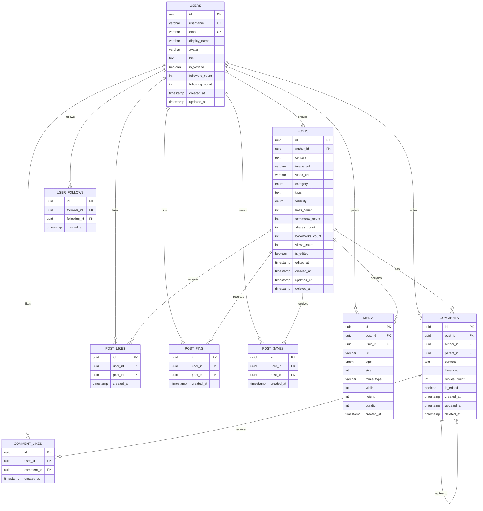

# Angular SSR News Feed Application

A full-stack news feed application built with **Angular 21 SSR** (Server-Side Rendering) and **NestJS** backend, featuring modern web development practices and educational components.

## 🏗️ Architecture Overview

```
┌─────────────────────────────────────────────────────────────────────────────┐
│                              CLIENT BROWSER                                  │
├─────────────────────────────────────────────────────────────────────────────┤
│                                    │                                         │
│                                    ▼                                         │
│  ┌──────────────────────────────────────────────────────────────────────┐   │
│  │                     ANGULAR 21 SSR FRONTEND                          │   │
│  │  ┌─────────────┐  ┌─────────────┐  ┌─────────────┐  ┌─────────────┐  │   │
│  │  │   Pages     │  │ Components  │  │  Services   │  │   Signals   │  │   │
│  │  │             │  │             │  │             │  │   State     │  │   │
│  │  │ • Home      │  │ • NavPanel  │  │ • NewsFeed  │  │             │  │   │
│  │  │ • Dashboard │  │ • PostCard  │  │ • API       │  │ • Reactive  │  │   │
│  │  │ • NewsFeed  │  │ • Comments  │  │ • Storage   │  │ • Computed  │  │   │
│  │  │ • SSR Demos │  │ • Infinite  │  │             │  │             │  │   │
│  │  └─────────────┘  └─────────────┘  └─────────────┘  └─────────────┘  │   │
│  │                                                                       │   │
│  │  Server: Express.js (SSR) │ Hydration │ Lazy Loading │ Standalone    │   │
│  └──────────────────────────────────────────────────────────────────────┘   │
│                                    │                                         │
│                                    ▼ HTTP/REST                               │
│  ┌──────────────────────────────────────────────────────────────────────┐   │
│  │                       NESTJS BACKEND API                              │   │
│  │  ┌─────────────┐  ┌─────────────┐  ┌─────────────┐  ┌─────────────┐  │   │
│  │  │ Controllers │  │  Services   │  │   DTOs      │  │  Entities   │  │   │
│  │  │             │  │             │  │             │  │             │  │   │
│  │  │ • NewsFeed  │  │ • NewsFeed  │  │ • Request   │  │ • User      │  │   │
│  │  │ • Users     │  │ • Storage   │  │ • Response  │  │ • Post      │  │   │
│  │  │ • Comments  │  │ • Cache     │  │ • Filters   │  │ • Comment   │  │   │
│  │  └─────────────┘  └─────────────┘  └─────────────┘  └─────────────┘  │   │
│  │                                                                       │   │
│  │  TypeORM │ Validation │ Config │ Dependency Injection                │   │
│  └──────────────────────────────────────────────────────────────────────┘   │
│                                    │                                         │
│              ┌─────────────────────┼─────────────────────┐                   │
│              ▼                     ▼                     ▼                   │
│  ┌───────────────────┐  ┌───────────────────┐  ┌───────────────────┐        │
│  │    PostgreSQL     │  │      Redis        │  │      MinIO        │        │
│  │    (Database)     │  │     (Cache)       │  │  (File Storage)   │        │
│  │                   │  │                   │  │                   │        │
│  │ • Users           │  │ • Session cache   │  │ • Media uploads   │        │
│  │ • Posts           │  │ • Feed cache      │  │ • S3-compatible   │        │
│  │ • Comments        │  │ • Rate limiting   │  │ • Pre-signed URLs │        │
│  │ • Interactions    │  │ • Pub/Sub         │  │                   │        │
│  └───────────────────┘  └───────────────────┘  └───────────────────┘        │
└─────────────────────────────────────────────────────────────────────────────┘
```

## 🛠️ Tech Stack

### Frontend
| Technology | Version | Purpose |
|------------|---------|---------|
| Angular | 21.1.0 | Core framework with SSR support |
| @angular/ssr | 21.1.2 | Server-side rendering |
| Express | 5.1.0 | SSR server |
| RxJS | 7.8.0 | Reactive programming |
| TypeScript | 5.8.x | Type safety |

### Backend
| Technology | Version | Purpose |
|------------|---------|---------|
| NestJS | 11.0.1 | Backend framework |
| TypeORM | 0.3.28 | Database ORM |
| PostgreSQL | 17 | Primary database |
| Redis | 7.4 | Caching layer |
| MinIO | Latest | S3-compatible object storage |
| AWS SDK v3 | 3.985.0 | S3 client for MinIO |

## 📁 Project Structure

```
angular-ssr/
├── frontend/                    # Angular SSR Application
│   ├── src/
│   │   ├── app/
│   │   │   ├── components/      # Reusable UI components
│   │   │   │   └── nav-panel/   # Navigation sidebar
│   │   │   ├── pages/           # Route components
│   │   │   │   ├── home/        # Landing page
│   │   │   │   ├── dashboard/   # User dashboard
│   │   │   │   ├── news-feed/   # Main feed with infinite scroll
│   │   │   │   ├── ssr-basics/  # SSR educational demo
│   │   │   │   ├── render-modes/# Rendering modes comparison
│   │   │   │   ├── hydration-demo/ # Hydration explanation
│   │   │   │   ├── architecture/# Architecture overview
│   │   │   │   ├── build-tools/ # Build tooling info
│   │   │   │   └── infinite-scroll/ # Scroll demo
│   │   │   ├── app.routes.ts    # Route definitions
│   │   │   ├── app.routes.server.ts # Server-side routes
│   │   │   └── app.config.ts    # App configuration
│   │   ├── main.ts              # Browser bootstrap
│   │   ├── main.server.ts       # Server bootstrap
│   │   └── server.ts            # Express SSR server
│   ├── angular.json             # Angular CLI config
│   └── package.json
│
├── backend/                     # NestJS API Server
│   ├── src/
│   │   ├── config/              # Environment configuration
│   │   │   └── environment.config.ts
│   │   ├── database/            # Database configuration
│   │   │   └── typeorm.config.ts
│   │   ├── storage/             # File storage service
│   │   │   └── storage.service.ts
│   │   ├── news-feed/           # News feed module
│   │   │   ├── controllers/     # API endpoints
│   │   │   │   └── news-feed.controller.ts
│   │   │   ├── services/        # Business logic
│   │   │   │   └── news-feed.service.ts
│   │   │   ├── dto/             # Data transfer objects
│   │   │   │   └── news-feed.dto.ts
│   │   │   ├── entities/        # TypeORM entities
│   │   │   │   └── database-schema.ts
│   │   │   └── news-feed.module.ts
│   │   ├── app.module.ts        # Root module
│   │   └── main.ts              # Application entry
│   ├── init-scripts/            # Database init scripts
│   │   ├── 01-init-schema.sql   # Create tables
│   │   └── 02-seed-data.sql     # Seed data
│   ├── docker-compose.yml       # Local dev infrastructure
│   └── package.json
│
├── DOCKER.md                    # Docker documentation
└── README.md                    # This file
```

## 🗄️ Database Schema

### Entity Relationship Diagram



### Table Relationships Summary

| Relationship | Type | Description |
|--------------|------|-------------|
| Users → Posts | One-to-Many | A user can create many posts |
| Users → Comments | One-to-Many | A user can write many comments |
| Posts → Comments | One-to-Many | A post can have many comments |
| Comments → Comments | Self-referential | Comments can have nested replies |
| Users ↔ Posts (Likes) | Many-to-Many | Users can like many posts |
| Users ↔ Posts (Pins) | Many-to-Many | Users can pin posts to profile |
| Users ↔ Posts (Saves) | Many-to-Many | Users can save posts |
| Users ↔ Users (Follows) | Many-to-Many | Users can follow each other |
| Posts → Media | One-to-Many | Posts can have multiple media files |

### Post Categories
- `technology` - Tech news and updates
- `sports` - Sports news
- `finance` - Financial news
- `health` - Health and wellness
- `travel` - Travel adventures
- `food` - Food and recipes
- `science` - Scientific discoveries
- `entertainment` - Movies, music, etc.
- `politics` - Political news
- `crypto` - Cryptocurrency
- `general` - General posts

## 🚀 Getting Started

### Prerequisites
- Node.js 20+
- Docker & Docker Compose
- npm or yarn

### 1. Clone the Repository
```bash
git clone https://github.com/KishoreKumarManchikanti/Angular-learning.git
cd Angular-learning
```

### 2. Start Infrastructure (Docker)
```bash
cd backend
docker compose up -d
```

This starts:
- **PostgreSQL** on port 5432
- **Redis** on port 6379
- **MinIO** on ports 9000 (API) / 9001 (Console)
- **pgAdmin** on port 5050

### 3. Install Dependencies
```bash
# Backend
cd backend
npm install

# Frontend
cd ../frontend
npm install
```

### 4. Start Development Servers
```bash
# Terminal 1: Backend (port 3000)
cd backend
npm run start:dev

# Terminal 2: Frontend (port 4200)
cd frontend
npm start
```

### 5. Access the Application
- **Frontend**: http://localhost:4200
- **Backend API**: http://localhost:3000
- **pgAdmin**: http://localhost:5050 (admin@admin.com / admin)
- **MinIO Console**: http://localhost:9001 (minioadmin / minioadmin)

## 🔌 API Endpoints

### News Feed
| Method | Endpoint | Description |
|--------|----------|-------------|
| GET | `/news-feed` | Get paginated feed |
| GET | `/news-feed/:id` | Get single post |
| POST | `/news-feed` | Create new post |
| PUT | `/news-feed/:id` | Update post |
| DELETE | `/news-feed/:id` | Delete post |

### Post Interactions
| Method | Endpoint | Description |
|--------|----------|-------------|
| POST | `/news-feed/:id/like` | Like a post |
| DELETE | `/news-feed/:id/like` | Unlike a post |
| POST | `/news-feed/:id/pin` | Pin a post |
| DELETE | `/news-feed/:id/pin` | Unpin a post |
| POST | `/news-feed/:id/save` | Save a post |
| DELETE | `/news-feed/:id/save` | Unsave a post |

### Comments
| Method | Endpoint | Description |
|--------|----------|-------------|
| GET | `/news-feed/:id/comments` | Get comments for post |
| POST | `/news-feed/:id/comments` | Add comment |
| PUT | `/news-feed/comments/:commentId` | Update comment |
| DELETE | `/news-feed/comments/:commentId` | Delete comment |
| POST | `/news-feed/comments/:id/like` | Like a comment |

### Query Parameters (GET /news-feed)
| Parameter | Type | Description |
|-----------|------|-------------|
| page | number | Page number (default: 1) |
| limit | number | Items per page (default: 10, max: 50) |
| category | string | Filter by category |
| sortBy | string | Sort field (createdAt, likesCount, etc.) |
| sortOrder | string | asc or desc |
| search | string | Search in content |

## ⚙️ Environment Variables

### Backend (.env)
```env
# Database
DB_HOST=localhost
DB_PORT=5432
DB_USERNAME=postgres
DB_PASSWORD=postgres
DB_DATABASE=newsfeed_dev

# Redis
REDIS_HOST=localhost
REDIS_PORT=6379

# MinIO
MINIO_ENDPOINT=localhost
MINIO_PORT=9000
MINIO_ACCESS_KEY=minioadmin
MINIO_SECRET_KEY=minioadmin
MINIO_BUCKET=newsfeed-media-dev
MINIO_USE_SSL=false

# App
PORT=3000
NODE_ENV=development
```

## 📚 Educational Features

This project includes educational components explaining Angular SSR concepts:

| Page | Description |
|------|-------------|
| `/ssr-basics` | Introduction to Server-Side Rendering |
| `/render-modes` | CSR vs SSR vs SSG comparison |
| `/hydration-demo` | How Angular hydration works |
| `/architecture` | Application architecture overview |
| `/build-tools` | Build process and tooling |
| `/infinite-scroll` | Infinite scroll implementation |

## 🐳 Docker Services

| Service | Image | Port | Purpose |
|---------|-------|------|---------|
| postgres | postgres:17-alpine | 5432 | Primary database |
| redis | redis:7.4-alpine | 6379 | Caching & sessions |
| minio | minio/minio:latest | 9000, 9001 | Object storage |
| pgadmin | dpage/pgadmin4 | 5050 | Database GUI |

## 🔧 Development Commands

### Frontend
```bash
npm start          # Dev server (port 4200)
npm run build      # Production build
npm run serve:ssr  # Serve SSR build
npm test           # Run tests
```

### Backend
```bash
npm run start:dev   # Dev server with hot reload
npm run build       # Production build
npm run start:prod  # Run production build
npm run lint        # Lint code
npm test            # Run unit tests
npm run test:e2e    # Run e2e tests
```

### Docker
```bash
docker compose up -d       # Start all services
docker compose down        # Stop all services
docker compose down -v     # Stop and remove volumes
docker compose logs -f     # View logs
```

## 📝 License

UNLICENSED - Private project

## 👤 Author

Kishore Kumar Manchikanti

---

**Happy Coding!** 🎉
